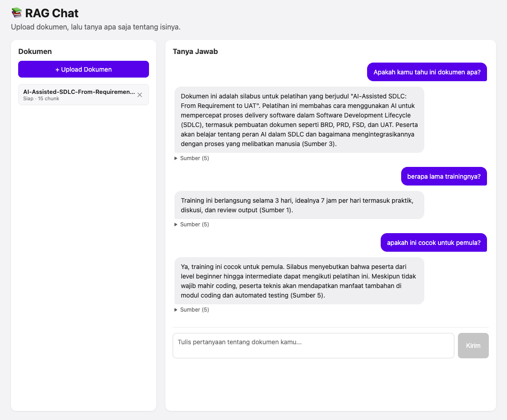

# RAG Chat App (Node.js + TypeScript + React)



Aplikasi web sederhana untuk upload dokumen (PDF/DOCX/TXT/MD) lalu bertanya
tentang isinya melalui chat, menggunakan pendekatan Retrieval-Augmented
Generation (RAG).

## Arsitektur

```
rag-app/
├── server/     Backend: Express + TypeScript + SQLite (better-sqlite3) + OpenAI
└── client/     Frontend: React + TypeScript + Vite
```

**Alur kerja:**
1. User upload dokumen → teks diekstrak → dipecah jadi chunk → tiap chunk
   diubah jadi embedding (OpenAI) → disimpan di SQLite.
2. User bertanya → pertanyaan diubah jadi embedding → dicari chunk paling
   mirip (cosine similarity, dihitung langsung di Node.js) → top-5 chunk
   dijadikan konteks untuk prompt ke OpenAI Chat Completion.
3. Jawaban dikembalikan beserta daftar sumber (dokumen & bagian) yang dipakai.

> Catatan: Similarity search dihitung "brute-force" di JavaScript (loop semua
> chunk). Ini cukup cepat untuk ratusan-ribuan chunk (skala prototipe/small
> app). Untuk skala jauh lebih besar, pertimbangkan migrasi ke vector DB
> khusus (Qdrant, pgvector, dll) — struktur kode ini sudah memisahkan bagian
> retrieval (`similarity.ts`, `db.ts`) sehingga migrasinya relatif mudah.

## Persiapan

### 1. Backend

```bash
cd server
npm install
cp .env.example .env
```

Edit file `.env` dan isi `OPENAI_API_KEY` dengan API key OpenAI kamu:

```
OPENAI_API_KEY=sk-xxxxxxxxxxxxxxxxxxxx
PORT=3001
EMBEDDING_MODEL=text-embedding-3-small
CHAT_MODEL=gpt-4o-mini
```

Jalankan server (development, auto-reload):

```bash
npm run dev
```

Server akan berjalan di `http://localhost:3001`.

### 2. Frontend

Di terminal terpisah:

```bash
cd client
npm install
npm run dev
```

Buka `http://localhost:5173` di browser. Request ke `/api/*` otomatis
di-proxy ke backend (lihat `vite.config.ts`).

## Cara Pakai

1. Buka aplikasi di browser.
2. Klik **"+ Upload Dokumen"**, pilih file PDF/DOCX/TXT/MD.
3. Tunggu status dokumen berubah jadi **"Siap"** (biasanya beberapa detik,
   tergantung ukuran dokumen — proses ekstraksi teks + embedding).
4. Ketik pertanyaan di kotak chat, tekan Enter atau klik "Kirim".
5. Jawaban akan muncul beserta daftar sumber (bisa diklik "Sumber (n)" untuk
   melihat potongan teks yang dipakai sebagai referensi).

## Build untuk Production

```bash
# Backend
cd server
npm run build
npm start

# Frontend
cd client
npm run build
# hasil build ada di client/dist, bisa di-serve via static hosting apapun
# atau tambahkan express.static di server untuk serve dari backend yang sama
```

## Kustomisasi Lanjutan (ide pengembangan)

- **Streaming jawaban**: gunakan `stream: true` di
  `openai.chat.completions.create` + Server-Sent Events supaya jawaban
  muncul kata-per-kata seperti ChatGPT.
- **Hybrid search**: kombinasikan cosine similarity dengan keyword search
  (SQLite FTS5) untuk hasil retrieval yang lebih akurat.
- **Re-ranking**: setelah top-k awal, gunakan cross-encoder atau LLM untuk
  menyaring ulang chunk paling relevan.
- **Chunking lebih canggih**: chunking berbasis heading/struktur dokumen,
  atau semantic chunking.
- **Autentikasi multi-user**: tambahkan kolom `user_id` di tabel `documents`
  supaya tiap user hanya bisa akses dokumennya sendiri.
- **Vector DB eksternal**: kalau data sudah besar (>10rb chunk), migrasi ke
  Qdrant/pgvector untuk performa retrieval yang lebih baik.

## Troubleshooting

- **Error "OPENAI_API_KEY belum diset"**: pastikan file `.env` sudah dibuat
  dan berisi API key yang valid.
- **Upload gagal untuk PDF hasil scan**: `pdf-parse` hanya membaca teks asli
  dari PDF, bukan OCR. Untuk PDF hasil scan (gambar), perlu tambahan OCR
  (misal `tesseract.js`).
- **CORS error**: pastikan backend jalan di port 3001 dan frontend di 5173,
  atau sesuaikan `vite.config.ts` kalau port berbeda.
